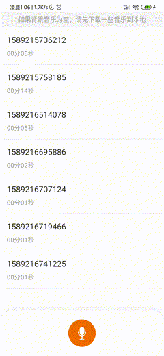

<h1 align="center">
  录音工具-Mp3Recorder
</h1>

[](https://jitpack.io/#SheTieJun/Mp3Recorder)

<p align="center">
 <a href="README.en.md">English</a> | <a href="README.md">简体中文</a> 
</p>

-   Record and transcode MP3 at the same time, the default startup system comes with it[If the phone supports]AEC, NC, AGC.
-   Supports pause and real-time return**Recording duration**and current**sound volume**, the recorded audio is**Can play**of.
-   Support adding background music, you can set the size of the background music sound
-   You can use the default headset configuration method: if no headset is connected, only the external background music will be used. If the headset is connected, the method of writing synthesized background music will be used.
-   other..

### Demo1[APP download](https://fir.xcxwo.com/ne21)



## 1. Access configuration

**[Access configuration document](https://github.com/SheTieJun/Mp3Recorder/wiki/%E6%8E%A5%E5%85%A5%E6%96%87%E6%A1%A3)**

### 1. How to choose

    implementation "com.github.SheTieJun.Mp3Recorder:recorder-core:$sdk_version"//必选+（下面3个至少选一个）
    implementation "com.github.SheTieJun.Mp3Recorder:recorder-sim:$sdk_version"//可选
    implementation "com.github.SheTieJun.Mp3Recorder:recorder-mix:$sdk_version"//可选
    implementation "com.github.SheTieJun.Mp3Recorder:recorder-st:$sdk_version" //可选，已初步测试（变音参数需要自己调试）

### Please select the appropriate Recorder to write the function

-   If you are just recording, there is no requirement for background music. There will be no background music after wearing headphones:[SimRecorder](recorder-sim)
-   If you are recording, you need to add background music at any time, and it is required to support background music even with headphones:[MixRecorder](recorder-mix)
-   If there is no background music during recording, but voice changing is supported at any time:[STReccorder](recorder-st)

## 2.["Background Music" recording recommendation](recorder-sim)：

    implementation 'com.github.SheTieJun.Mp3Recorder:recorder-mix:版本号'
    implementation 'com.github.SheTieJun.Mp3Recorder:recorder-core:版本号'

#### 1). Background music recording related

-   You can interrupt, play, and replace background music at any time during recording
-   If the background music parameters are different in my library, you need to set the parameters yourself. If they are different, the background music will be longer or faster.

#### 2). Disadvantages

-   Recording channel number settings, because of synthesis, all you**Need to set the same parameters as the background music**
-   If you set mono, the background played will be dual-channel, and (MIX) will make the music longer; otherwise, if dual-sound is synthesized, the background music will be single-sound, and the rhythm will become faster.
-   tip: Background music supports network links, but poor network conditions may cause lag, so please try not to use network links as background music applications.

## 3.[Recommended recording of "Changed Voice"](recorder-st)(Preliminary completion, not perfect):

    implementation 'com.github.SheTieJun.Mp3Recorder:recorder-core:版本号'
    implementation 'com.github.SheTieJun.Mp3Recorder:recorder-st:版本号'

#### 1). Voice change recording related (SoundTouch)

-   Recording can be interrupted at any time and resumed to perform functions such as voice changing, speed changing, etc.

```kotlin
    //指定播放速率
fun setRate(speed: Float)

//一般用来设置倍速，我们变音，默认 1.0就好
fun setTempo(tempo: Float)

//在原速1.0基础上，按百分比做增量，取值(-50 .. +100 %)
fun setRateChange(@FloatRange(from = -50.0, to = 100.0) rateChange: Float)

//在原速1.0基础上 源tempo=1.0，小于1则变慢；大于1变快 tempo (-50 .. +100 %)
fun setTempoChange(@FloatRange(from = -50.0, to = 100.0) tempoChange: Float)

//在源pitch的基础上，使用半音(Semitones)设置新的pitch [-12.0,12.0]
//男声:-
//女声:+
fun setPitchSemiTones(@FloatRange(from = -12.0, to = 12.0) pitch: Float)

```

## 2. Instructions for use

-   **[Instructions for use](https://github.com/SheTieJun/Mp3Recorder/wiki/%E4%BD%BF%E7%94%A8%E6%96%87%E6%A1%A3)**
-   [Audio basics](https://blog.csdn.net/StjunF/article/details/121296111)


     采样频率越高， 声音越接近原始数据。
     采样位数越高，声音越接近原始数据。
     比特率越高，传送的数据越大，音质越好

## Get the current best sampling rate of the mobile phone

```kotlin
val am = getSystemService(Context.AUDIO_SERVICE) as AudioManager
val sampleRateStr: String? = am.getProperty(AudioManager.PROPERTY_OUTPUT_SAMPLE_RATE)
var sampleRate: Int = sampleRateStr?.let { str ->
    Integer.parseInt(str).takeUnless { it == 0 }
} ?: 44100 
```

```kotlin
abstract class BaseRecorder {

    // 录音Recorder 是否在活动，暂停的时候isActive 还是true,只有录音结束了才会为false
    var isActive = false

    //当前状态
    var state = RecordState.STOPPED

    //录制时间
    var duration = 0L

    //设置是否使用耳机配置方式
    abstract fun setContextToPlugConfig(context: Context): BaseRecorder

    //设置声音配置，设置后，修改设置声音大小会修改系统播放声音的大小
    abstract fun setContextToVolumeConfig(context: Context): BaseRecorder

    //设置录音输出文件,
    abstract fun setOutputFile(outputFile: String, isContinue: Boolean = false): BaseRecorder

    /**
     * 设置录音输出文件
     * @param outputFile 设置输出路径
     * @param isContinue 表示是否拼接在文件末尾，实现继续录制的一种方式
     */
    open fun setOutputFile(outputFile: File, isContinue: Boolean = false): BaseRecorder {/*...*/
    }

    //设置录音监听
    open fun setRecordListener(recordListener: RecordListener?): BaseRecorder {/*...*/
    }

    //设置权限监听
    open fun setPermissionListener(permissionListener: PermissionListener?): BaseRecorder {/*...*/
    }

    open fun setPCMListener(pcmListener: PCMListener?): BaseRecorder {/*...*/
    }

    //设计背景音乐的url,本地的(网络的可能造成卡死)
    abstract fun setBackgroundMusic(url: String): BaseRecorder

    //是否循环播放，默认true
    abstract fun setLoopMusic(isLoop: Boolean): BaseRecorder

    //背景音乐的url,兼容Android Q
    abstract fun setBackgroundMusic(context: Context, uri: Uri, header: MutableMap<String, String>?): BaseRecorder

    //设置背景音乐的监听
    abstract fun setBackgroundMusicListener(listener: PlayerListener): BaseRecorder


    //初始Lame录音输出质量
    abstract fun setMp3Quality(@IntRange(from = 0, to = 9) mp3Quality: Int): BaseRecorder

    //设置比特率，关系声音的质量
    abstract fun setMp3BitRate(@IntRange(from = 16) mp3BitRate: Int): BaseRecorder

    //设置采样率，默认44100
    abstract fun setSamplingRate(@IntRange(from = 8000) rate: Int): BaseRecorder

    //设置音频声道数量，每次录音前可以设置修改，开始录音后无法修改
    abstract fun setAudioChannel(@IntRange(from = 1, to = 2) channel: Int = 1): Boolean

    //设置音频来源，每次录音前可以设置修改，开始录音后无法修改
    abstract fun setAudioSource(@Source audioSource: Int = MediaRecorder.AudioSource.MIC): Boolean

    //设置声波过滤器
    open fun setFilter(lowpassFreq: Int = 3000, highpassFreq: Int = 200) {/*...*/
    }

    //初始最大录制时间 和提醒时间 remind = maxTime - remindDiffTime
    abstract fun setMaxTime(maxTime: Int, remindDiffTime: Int? = null): BaseRecorder

    //设置背景声音大小
    abstract fun setBGMVolume(volume: Float): BaseRecorder

    //移除背景音乐
    abstract fun cleanBackgroundMusic()

    //开始录音
    abstract fun start()

    //完成录音
    abstract fun complete()

    //重新开始录音
    abstract fun resume()

    //替换输出文件
    abstract fun updateDataEncode(outputFilePath: String)

    //暂停录音
    abstract fun pause()

    //是否设置了并且开始播放了背景音乐
    abstract fun isPlayMusic(): Boolean

    //开始播放音乐
    abstract fun startPlayMusic()

    //是否在播放音乐
    abstract fun isPauseMusic(): Boolean

    //暂停背景音乐
    abstract fun pauseMusic()

    //重新播放背景音乐
    abstract fun resumeMusic()

    //重置
    abstract fun reset()

    //结束释放
    abstract fun destroy()

    //变音相关
    open fun getSoundTouch(): ISoundTouchCore
}
```

## other

### 1.[Old version](https://github.com/SheTieJun/Mp3Recorder/tree/master_copy)

### 2.[Update_log](https://github.com/SheTieJun/Mp3Recorder/wiki/%E6%9B%B4%E6%96%B0%E6%97%A5%E5%BF%97)

### 3.[License](https://github.com/SheTieJun/Mp3Recorder/blob/master/LICENSE)

### 4.[Introduction to MediaRecorder](doc/MediaRecorder.MD): It is more convenient to use MediaRecorder in some scenarios.
